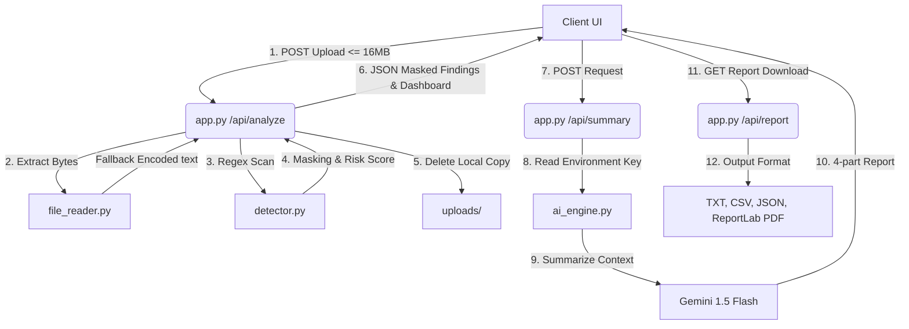

# Sensitive Data Detection & Compliance Assistant

An intelligent, self-contained cyber-security compliance product designed to scan documents (PDF, TXT, CSV), identify sensitive data patterns (PII, credentials, payment data), calculate risk levels with detailed grammar-perfect explanations, generate structured AI compliance reports, and allow interactive Q&A.

---

## 1. Project Overview
The **Sensitive Data Detection & Compliance Assistant** acts as a lightweight security shield. It automatically analyzes documents uploaded by users, applies optimized regex classifiers to detect credentials, bank accounts, Aadhaar, PAN, and passwords, masks them immediately to prevent leakage, scores the file risk under security-hardened limits, and generates detailed summaries using Gemini 1.5 Flash.

---

## 2. Features
- **Multi-format Support**: Secure text extraction from PDF, TXT, and CSV formats.
- **Robust CSV Decoding**: Automatic decoding fallback support for UTF-8 and Latin-1 encodings, handling malformed CSV inputs gracefully.
- **Secure Handling**: Automated immediate deletion of uploads right after extraction to prevent local server footprint.
- **Masked Previews**: Returns masked credentials (`jo******@example.com`, `sk-********abcd`, `Password Detected`) to secure client presentation.
- **Risk Score Capping**: Caps category contributions to prevent spam (e.g. dozens of email addresses) from falsely inflating risk values.
- **Step-based Loaders**: Dynamic animated progress feedback indicators showing file processing.
- **Interactive QA Chatbot**: In-context document query chatbot with input lock limits.
- **Report Downloads**: Instant, server-generated report downloads available in TXT, CSV, JSON, and professional PDF (via ReportLab flowables).

---

## 3. Folder Structure
```
sensitive-data-webapp/
├── app.py                  # Core Flask Application server and routing
├── detector.py             # Regex patterns, custom masking, and risk algorithms
├── file_reader.py          # PDF, TXT, and CSV readers with robust fallbacks
├── ai_engine.py            # Google Gemini AI Summary and Chatbot models
├── requirements.txt        # Production Python dependencies
├── Procfile                # Heroku/Render process commands
├── render.yaml             # Render deployment blueprint specifications
├── templates/
│   └── index.html          # Semantic HTML dashboard template
└── static/
    ├── css/
    │   └── style.css       # Responsive cyber-security CSS layout styles
    └── js/
        └── script.js       # Client async API managers and step progress handlers
```

---

## 4. Architecture Diagram


---

## 5. Installation & Setup

### Prerequisites
- Python 3.8+
- Gemini API Key

### Steps
1. **Clone/Copy Project**:
   Ensure files are arranged in the specified layout.
2. **Install Dependencies**:
   ```bash
   pip install -r requirements.txt
   ```
3. **Environment Setup**:
   Create a `.env` file in the root directory:
   ```env
   GEMINI_API_KEY=your_google_gemini_api_key_here
   PORT=5000
   ```
4. **Run Application**:
   ```bash
   python app.py
   ```
   Open `http://localhost:5000` in your web browser.

---

## 6. How Detection Works

### Regex Detection (`detector.py`)
Optimized regular expressions search for typical security leakage anchors:
- **Aadhaar Number**: `\b\d{4}\s?\d{4}\s?\d{4}\b`
- **PAN Number**: `\b[A-Z]{5}[0-9]{4}[A-Z]{1}\b`
- **Email Address**: `\b[A-Za-z0-9._%+-]+@[A-Za-z0-9.-]+\.[A-Z|a-z]{2,}\b`
- **Phone Number**: `\b(?:\+91[-\s]?)?[6-9]\d{9}\b`
- **Credit Card Number**: `\b(?:\d[ -]*?){13,16}\b`
- **Bank Account Number**: `(?i)(?:account\s*(?:no|number)?|a/c)\s*[:=]?\s*(\d{9,18})\b`
- **API Key / Secret**: `(?i)(?:api[_-]?key|secret[_-]?key|access[_-]?token)\s*[:=]\s*[\'\"]?([A-Za-z0-9_\-]{16,})[\'\"]?`
- **Password**: `(?i)(?:password|passwd|pwd)\s*[:=]\s*[\'\"]?(\S{4,})[\'\"]?`

### Risk Classification Logic
Risk categories carry different severity levels:
- **High Importance (Weight 8-10)**: Passwords, API Keys, Credit Cards, Aadhaar, PAN, Bank Details.
- **Lower Importance (Weight 2-3)**: Email, Phone Number, IP Address, Employee ID.

**Anti-Inflate Capping**:
To prevent a file containing dozens of low-priority email addresses from scoring as high-risk, the scoring algorithm caps the item count per category to **max 3**:
$$\text{Score} = \sum (\text{Category Weight} \times \min(\text{Items Detected}, 3))$$

**Risk Levels**:
- **Low Risk**: $\text{Score} \le 5$
- **Medium Risk**: $5 < \text{Score} \le 15$
- **High Risk**: $\text{Score} > 15$

---

## 7. AI Workflow & Integration
- **Client request**: The backend receives requests to summarize or ask questions.
- **Gemini Setup**: `ai_engine.py` calls `google.generativeai` utilizing the `gemini-1.5-flash` model.
- **In-Context Prompting**:
  - The model is supplied with findings summaries, calculated risk indicators, and the first 2,000 characters of the document.
  - The model outputs a strict 4-part structure: Observations, Risks, Remediation, and Recommendations.

---

## 8. Deployment to Render
This project is configured to deploy directly to **Render** using the blueprint configuration file `render.yaml`.
1. Connect your repository to Render.
2. Select **Web Service** or use the **Blueprints** upload tool.
3. Configure the environment variable:
   - `GEMINI_API_KEY`: your Google Gemini key.
4. Render will automatically run the build command `pip install -r requirements.txt` and start the Gunicorn server via `gunicorn app:app`.

---

## 9. Challenges Faced & Mitigations
- **Non-ASCII Text & Encoding Crashes**: Uploading CSV documents formatted under Excel or Latin-1 would crash pandas' UTF-8 decoder. *Mitigation*: Implemented raw binary read handlers with automated encoding fallback attempts (trying `utf-8`, then `latin-1`).
- **Render Ephemeral Disk Cleanup**: Uploads directories on cloud instances can quickly fill up. *Mitigation*: Employed structured `try...finally` statements in the Flask analyzer to ensure local files are deleted from the disk immediately after extraction.

---

## 10. Future Improvements
- **OCR Parsing**: Add Tesseract or EasyOCR support to scan image-based PDFs.
- **Structured JSON schemas**: Utilize Gemini structured outputs to enforce report layouts natively.
